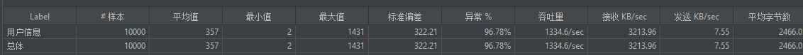

如需自己进行测试:
- 将dum.rdb拷贝到redis的data目录下后重启或是运行
`SellkillApplicationTests.contextLoads()`方法
- jmeter打开 [秒杀测试.jmx](秒杀测试.jmx)文件
- jmeter配置CSV数据文件设置和HTTP Cookie管理器

# 一、未进行任何优化前
## 测试规模

## 接口 /user/info
### 一个用户测试
**QPS: 1334.6**

### 两个用户测试
**QPS:1247.3**

## 接口 /seckill/doSeckill —— 秒杀接口
### 5000个用户同时访问
#### jmeter配置

#### **QPS: 135.1 **

#### 是否超卖
出现超买

